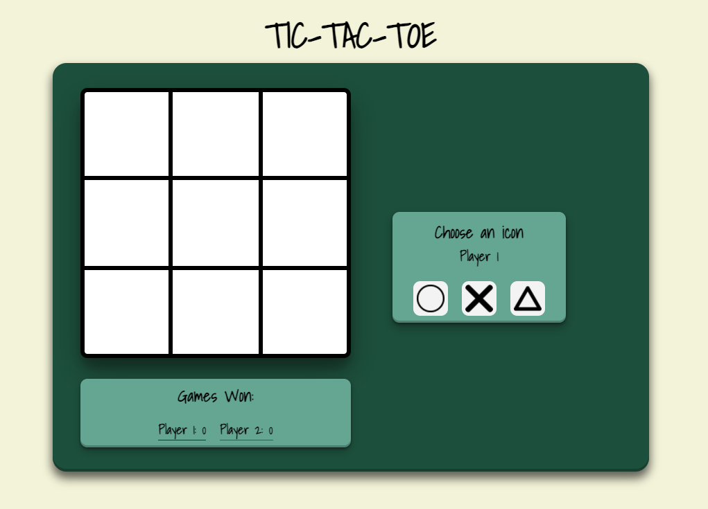

# Project 0 

## Tic-Tac-Toe

A classic game built completely from scratch. Fully responsive with media queries and the ability to choose your player icon. 

- Tech used:
  - JavaScript
  - jQuery
  - CSS
  - HTML

Known bug: PLayer 2 can select the same icon as player 1 which, whilst the game can still be played it is impossible to know where each player has moved.

Future improvements: 
  - Best out of x counter
  - animiation outlining how the player won 
  - adding more icons to choose from and fixing bug
  - style overhaul 
  - AI player
  - Multiplayer over network

  
Link to my tic-tac-toe game: https://dev-cam.github.io/tic-tac-toe/

